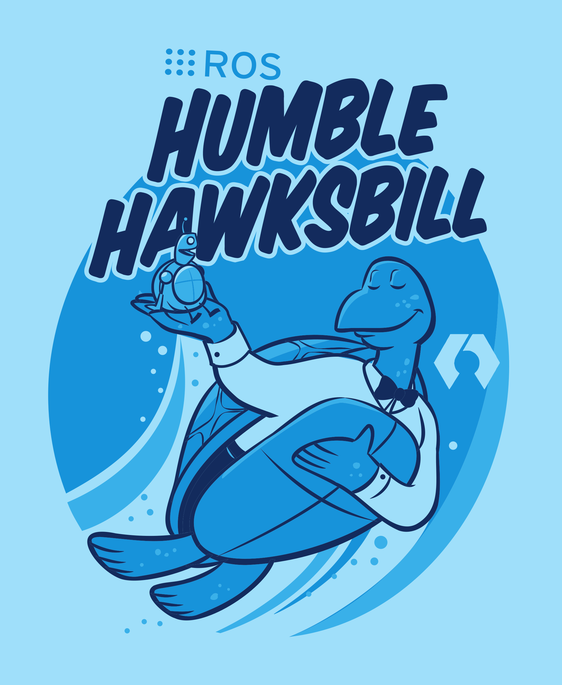

Hi My name is Herberto
================================================================================================================================

I've been coding and learning for several years now. Coming from data engineering with plcs, experimenting with frontend/backend using c#, I'm developing mobile, autonomous robots using ROS2/Python/C++. Right now, I'm exploring deep-learning based methods for 3D LiDAR Object Detection and deep-learning based reinforcement learning algorithms for navigation.

*   🖥️  See my portfolio at [All Projects are uploaded here](https://github.com/Hberto)
*   🚀  I'm currently working on [Deep Reinforcement Learning for mobile robots using transformer-based encoder with td3](https://github.com/Hberto/rl_mobile_robot_navigation)
*   🧠  I'm learning Nvidia Stack - IsaacSim, IsaacLab. CI/CD Pipelines
*   🤝  I'm open to collaborating on 3D LiDAR-based perception using a deep-learning approach. In general, open for projects related to robotics

  
                  

### 🛠 Skills

#### 🧾 Languages

  
  
  
  
  

#### 📊 Data Engineering

  <!-- Apache Spark -->
  
  <!-- Apache Cassandra -->
  
  <!-- Apache Kafka Icon Fallback (Inline SVG Base64 if external fails) -->

  <!-- MySQL -->
  
  <!-- Grafana (fallback PNG) -->
  

#### 🤖 Robotics & CV

  <!-- ROS2 -->
  
  <!-- Raspberry Pi -->
  
  <!-- Linux -->
  
  <!-- Docker -->
  

#### 🧠 ML / RL

  
  

  
### Socials
                  

 <a href="https://www.github.com/HBerto" target="_blank" rel="noreferrer"> <picture> <source media="(prefers-color-scheme: dark)" srcset="https://raw.githubusercontent.com/danielcranney/readme-generator/main/public/icons/socials/github-dark.svg" /> <source media="(prefers-color-scheme: light)" srcset="https://raw.githubusercontent.com/danielcranney/readme-generator/main/public/icons/socials/github.svg" />  </picture> </a>

### Badges

<b>My GitHub Stats</b>

